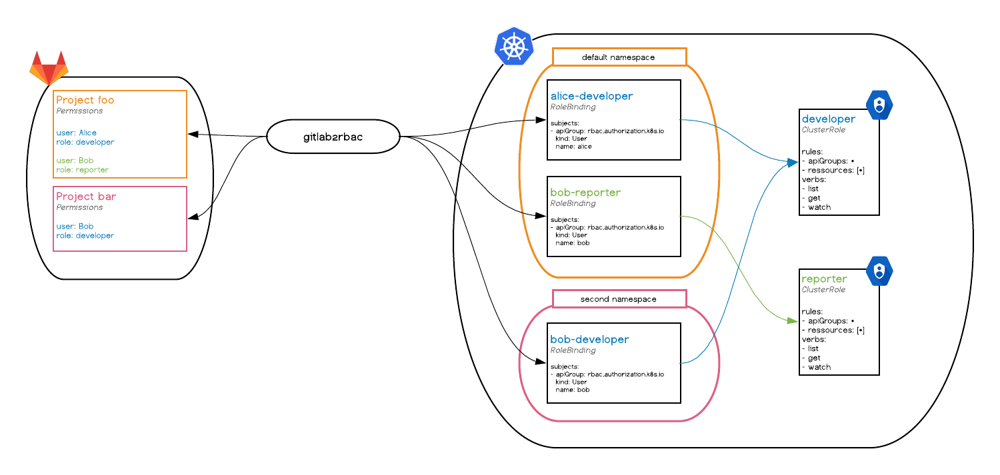

# gitlab2rbac

`gitlab2rbac` ensures that your Kubernetes cluster users have the same permissions than on GitLab.

It takes [GitLab Permissions](https://docs.gitlab.com/ee/user/permissions.html) by project as input and generates [RBAC](https://kubernetes.io/docs/admin/authorization/rbac/) objects inside Kubernetes.



## Installation

### Requirements

Before everything, `gitlab2rbac` requires:

* [RBAC enabled on your Kubernetes cluster](https://kubernetes.io/docs/reference/access-authn-authz/rbac/)
* [GitLab API with v4 support](https://docs.gitlab.com/ee/api/v3_to_v4.html)


### Configuration

`gitlab2rbac` needs a namespace, cluster roles and cluster role bindings. Create them with:

```sh
$ kubectl apply -f https://raw.githubusercontent.com/numberly/gitlab2rbac/master/deploy/configuration.yaml
```

You will then need to create a [ConfigMap](https://kubernetes.io/docs/tasks/configure-pod-container/configure-pod-configmap/) that contains all the useful information for `gitlab2rbac`:

```sh
cat <<EOF | kubectl create -f -
apiVersion: v1
kind: ConfigMap
metadata:
  name: gitlab2rbac
  namespace: gitlab2rbac
data:
  GITLAB_URL: https://{{ your GitLab instance URL }}
  GITLAB_PRIVATE_TOKEN: {{ your GitLab private token }}
  KUBERNETES_LOAD_INCLUSTER_CONFIG: "True"
EOF
```


### Deployment

Finally, just apply the manifest:

```sh
$ kubectl apply -f https://raw.githubusercontent.com/numberly/gitlab2rbac/master/deploy/gitlab2rbac.yaml
```

This will deploy `gitlab2rbac` to your cluster, under the `gitlab2rbac` namespace. The components in the manifest are:

* the deployment, which is the cluster-wide controller that handles RBAC policies
* the service account and the RBAC permissions that the controller need to function


## Running locally

### Requirements

* Python 3 (should also work with Python 2 but it's not supported)
* Virtualenv (recommended)

### Configuration

Even if `gitlab2rbac` doesn't run inside Kubernetes, it needs a cluster with existing cluster roles. Create them with:

```sh
$ kubectl apply -f https://raw.githubusercontent.com/numberly/gitlab2rbac/master/deploy/configuration.yaml
```

Then you can clone the repository, install the dependencies and run `gitlab2rbac`:

```sh
$ git clone https://github.com/numberly/gitlab2rbac.git
$ cd gitlab2rbac
$ virtualenv .venv && source .venv/bin/activate
(.venv) $ pip install -r requirements.txt
(.venv) $ GITLAB_URL={{ your GitLab instance URL }} GITLAB_PRIVATE_TOKEN={{ your GitLab private token }} python gitlab2rbac.py
```


## Advanced configuration

`gitlab2rbac` supports multiple environment variables for advanced configuration:

| Flag                              | Description                                                   | Default    | 
|:---------------------------------:|:-------------------------------------------------------------:|:----------:|
|GITLAB_URL                         |Configure gitlab API target.                                   |            |
|GITLAB_PRIVATE_TOKEN               |Configure gitlab API token.                                    |            |
|GITLAB_TIMEOUT                     |Timeout for operations in seconds.                             |10          |
|GITLAB_GROUP_SEARCH                |List projects from this group.                                 |gitlab2rbac |
|GITLAB_AUTO_CREATE                 |Create all necessary stuff on GitLab (group, projects).        |True        |
|KUBERNETES_LOAD_INCLUSTER_CONFIG   |Load configuration inside kubernetes when scrip run as a pod.  |False       |
|GITLAB2RBAC_FREQUENCY              |Update interval in seconds.                                    |60          |


## License

MIT
